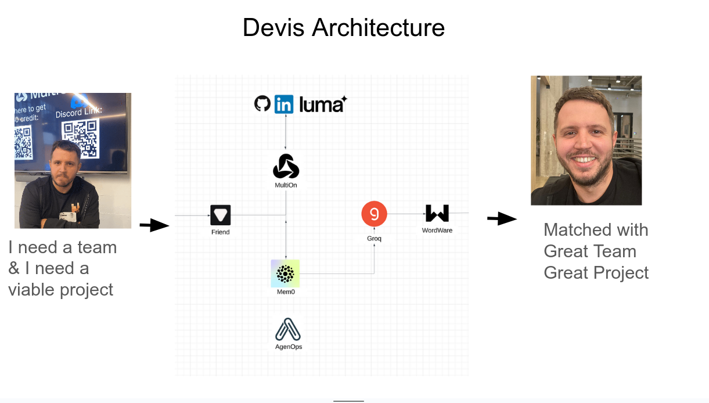

# Dev-advocate
### The go to platform for developers and tech companies to build strong relationships

> The project was developed during the AI Agents 2.0: Agents That Work. Hackathon by MultiOn & AgentOps
>
> July 20-21, 2024
> San Francisco, California
>
> Event url: https://lu.ma/ai-agents-2.0?tk=5epBFf

[](https://docs.google.com/presentation/d/1tluc6k5pEyvjjXWDcqVeWSMX4HglJSFlZX2wdlkOA4Y)

***🤖 Devis Demo 🤖 July 21-22, 2024***

https://www.youtube.com/watch?v=xMXv5dVLz3A

***Technologies used:***

- [MultiOn](https://docs.multion.ai/) - a human-language controlled browser agent (think of agentic Selenium) that lets you interact with any websites using human language rather than a mouse or a keyboard. Useful especially for the ones that require authentication and amazing for tedious tasks

- [AgentOps.ai](https://docs.agentops.ai) - allows you to track your agents execution time/latency, cost, errors, run evals (think of Datadog or Neptune.ai or Sentry)

- [Based Hardware (Friend)](https://docs.basedhardware.com/) - a necklace that listens and passes audio to your mobile account where through a marketplace of agents you can do stuff like talk to Devis, schedule calendar events, alarms, record meetings and much more

- [Mem0 (YC S24)](https://docs.mem0.ai/overview) - an easy to use memory layer for your agents and LLMs. Trending #1 on GitHub over the last week

- [Groq](https://console.groq.com/docs) - the industry leader in latency and cost per 1M tokens providing LPU-based inference to accelerate Open Source Models

- [Wordware (YC S24)](https://wordware.notion.site/d603670c4819487fa75185380c885007?v=91206410afab40dc8d92c189284cdb18) - an agentic IDE (in Notion style) - that I find perfect for prototyping UI and Docs fuelled by the most popular LLMs and agents

- [Anon](https://docs.anon.com/docs) - the toolkit that enables developers to build user-permissioned integrations for sites withoutAPIs. MultiOn uses Anon and enabled Devis to scrape user-permissioned data inaccessible through APIs and protected with bot-protection.


***Example:***
Output page: 

[Wordware output page](https://app.wordware.ai/share/88b27b72-1de2-4f83-a0d7-229542eb50cf/playground)

Data source: https://lu.ma/ai-agents-2.0?tk=5epBFf. Below is an example data extracted from the event page using human language and MultiOn:

```json
[
   {
      "website_url":"https://lu.ma/ai-agents-2.0?tk=5epBFf",
      "name":"AI Agents 2.0: Agents That Work. Hackathon by MultiOn & AgentOps",
      "date":"July 20",
      "venue":"San Francisco, California",
      "people":[
         "Mariane Bekker",
         "Div garg",
         "Jeremiah Owyang",
         "Michelle Gee",
         "Alex Reibman",
         "Alicia Lin",
         "Margarita Groisman",
         "Jeremy Nixon",
         "Steven Echtman"
      ],
      "companies":[
         "MultiOn",
         "AgentOps",
         "Founders Bay",
         "Arize AI",
         "Aiify.io Events",
         "AWS",
         "Groq",
         "Wordware",
         "CloudFlare",
         "Llama Lounge",
         "Llama Index",
         "Mem0",
         "Founders Institute",
         "Anon",
         "Based Hardware"
      ],
      "technologies":[
         "AI",
         "Agents",
         "MultiOn",
         "AgentOps",
         "AWS",
         "Groq",
         "Wordware",
         "Anon",
         "Friend AI Wearables",
         "Phoenix Traces",
         "Experiments",
         "Mem0 API",
         "Rabbit R1 AI device",
         "SpeedRead",
         "DoorDash",
         "AI Agents",
         "Llama Lounge",
         "Silicon Valley Impact",
         "Airtags",
         "Monitors",
         "Electric Scooter",
         "Theragun"
      ]
   }
]
```

##### How it works
Devis is an AI hackathon buddy that helps participants easily create a compatible team and a project they're interested in. 
Devis:
1. GATHERS HACKATHON & SPONSOR INFO by scraping the Hackathon's Luma
2. IDENTIFIES PARTICIPANT SUPERPOWERS by scraping their LinkedIn & Github to create their hackathon profile
3. TRANSCRIBES NETWORKING CONVERSATIONS using Friend Necklace
4. CREATES PROJECTS that are relevant, impressive and/or business viable projects & 
5. MATCHES PARTICIPANTS INTO TEAMS based on skill compatibility & project interest.


***Python version 3.10+***

```bash
python -m venv venv
source venv/bin/activate

pip install -r requirements.txt

// run the agent
python main.py
```